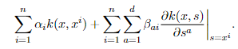

# Kernel-Based Differentiable Learning of Non-Parametric Directed Acyclic Graphical Models

If you are interested in the theoretical background, please refer to our paper:  
[1] Liang, Y., Zadorozhnyi, O., & Drton, M. (2024).  
[Kernel-Based Differentiable Learning of Non-Parametric Directed Acyclic Graphical Models](https://proceedings.mlr.press/v246/liang24a.html).  
*Proceedings of the 12th International Conference on Probabilistic Graphical Models (PGM 2024)*, PMLR 246, pp. 253–272.


## Contents
- `RKHS_DAGMA.py` - Supports continuous data for nonlinear models.
- `Toy_example.py` - Toy example with two nodes and common relationship from quadratic, qubic, inverse or sinus to illustrate RKHS-DAGMA.
- `Tuebingen` - Experiments of RKHS_DAGMA with real-world bivariate datasets.
- `experiments` - Experiments of RKHS_DAGMA with simulations compared with NOTEARS algorithms.

## Running a simple demo
The simplest way to illustrate RKHS-DAGMA is to run a toy example with two nodes where the functional relationship between two nodes is either quadratic, qubic, inverse or sinus:

```bash
cd RKHS/
python -m Toy_example -r quadratic
```

## Using RKHS-DAGMA
```bash
# X: Data matrix as a torch.tensor
device= torch.device('cuda' if torch.cuda.is_available() else 'cpu')
torch.set_default_device(device)
torch.set_default_dtype(torch.double)
X = X.to(device)
eq_model = RKHS_DAGMA.RKHSDagma(X).to(device)
model = RKHS_DAGMA.RKHSDagma_nonlinear(eq_model)
```

## An Overview of RKHS-DAGMA
We propose a novel approximation method for the non-linear relationships by kernels: Let $k$ be a given kernel and $f_j$ denote the non-linear relationship between jth random variable $X_j$ with other random variables, to learn a sparse directed acyclic graph, $f_j$ can be represented by the following formula:



